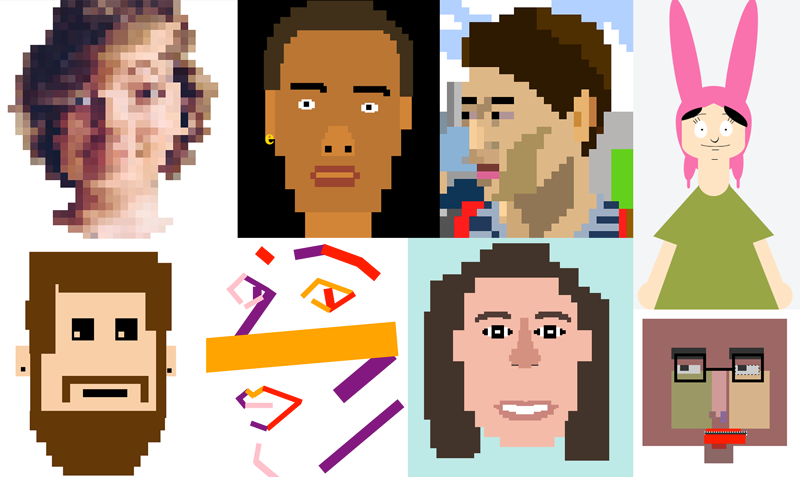

# CSS Self Portrait

Create a self-portrait using only HTML and CSS

Work by past students

## Instructions

- [ ] Fork this repository and clone it to your `critical-web-design` folder on your machine.

#### Design
- [ ] Plan your process and make sketches in [Figma](https://www.youtube.com/watch?v=AJK9NBGL5Bk)
- [ ] Look for inspiration - [famous self-portraits](https://mymodernmet.com/famous-self-portraits/), Dribble [flat characters](https://dribbble.com/search/flat%20characters), [@musketon](https://www.instagram.com/musketon/), [@thomcat23](https://www.instagram.com/thomcat23/), [@thomas_danthony](https://www.instagram.com/thomas_danthony/), [@vector.mob](https://www.instagram.com/vector.mob/), [@cecierlich](https://www.instagram.com/cecierlich/),
[@owendaveydraws](https://www.instagram.com/owendaveydraws/), [@mister_fred_berlin](https://www.instagram.com/mister_fred_berlin/), [@nina_dzyvulska](https://www.instagram.com/nina_dzyvulska/), [@eezy](https://www.instagram.com/eezy/), [abstractbrowsing.net](http://www.abstractbrowsing.net), [species-in-pieces.com](http://species-in-pieces.com/), [Form Art](http://www.c3.hu/collection/form/), [Lorna Mills](https://www.instagram.com/lorna.mills/?hl=en)
- [ ] For example, try drawing over an image of yourself in [Figma](https://figma.com) with the shape tool, choosing colors as you do. (feel free to experiment an find your own method!)

#### Code
- [ ] Use HTML, CSS, and JS to code your design inside `index.html`
- [ ] Add appropriate structural HTML tags (doctype, html, head, body, etc.)
- [ ] Create those elements with HTML `
` tags
- [ ] Use CSS properties to adjust the color, position, rotation, height, width, z-index, etc. of your elements
- [ ] Use only HTML and CSS for graphics; Do not add image or SVG files to the code.

#### Publish
- [ ] [Save and refresh](https://github.com/omundy/learn-computing/blob/main/topics-keyboard-shortcuts.md#web-development-edit-save-refresh-loop) your work in the browser often to see your changes.
- [ ] Commit changes regularly.
- [ ] Confirm valid [HTML](https://validator.w3.org/) and [CSS](https://jigsaw.w3.org/css-validator/) [(?)](https://github.com/omundy/dig245-critical-web-design/blob/main/reference-sheets/css.md#css-validation)
- [ ] When finished, [push, publish, and post your project](https://docs.google.com/document/d/17U_zmzM_eML_qkG0PaOdDRcEk3YEmbiQ1TyNnbAM08k/edit#bookmark=id.8jryplv1i8a)

Grading

Points | Description
---: | ---
4 | Concept
4 | Originality
4 | Execution / Technical
4 | Project is online, accessible, and linked from Moodle
4 | Valid HTML and CSS
20 | Total possible

## Resources

- Course references [HTML](https://github.com/omundy/dig245-critical-web-design/blob/main/reference-sheets/html.md), [CSS](https://github.com/omundy/dig245-critical-web-design/blob/main/reference-sheets/css.md), and [JS](https://github.com/omundy/dig245-critical-web-design/blob/main/reference-sheets/javascript.md)

<!-- past work  

Fall 2017
https://omundy.wordpress.com/2017/09/18/web-art-box-model-self-portraits-fall-2017/
katie https://jsfiddle.net/ow3n/yrvsLo9w/1/
ted https://jsfiddle.net/ow3n/1jmzworg/1/
lauren https://jsfiddle.net/ow3n/v1wpkyj4/1/

Spring 2015
https://omundy.wordpress.com/2015/03/30/web1-spring-2015-self-portrait-highlights/
colson https://jsfiddle.net/ow3n/k1s4x5fh/1/
connor https://jsfiddle.net/ow3n/rn40ho6z/1/
jacob https://jsfiddle.net/ow3n/t4n2wdp9/1/
felicia https://jsfiddle.net/ow3n/3fpxqosh/1/

Fall 2014
https://omundy.wordpress.com/2014/10/22/web1-box-model-self-portrait-post-here/

-->
